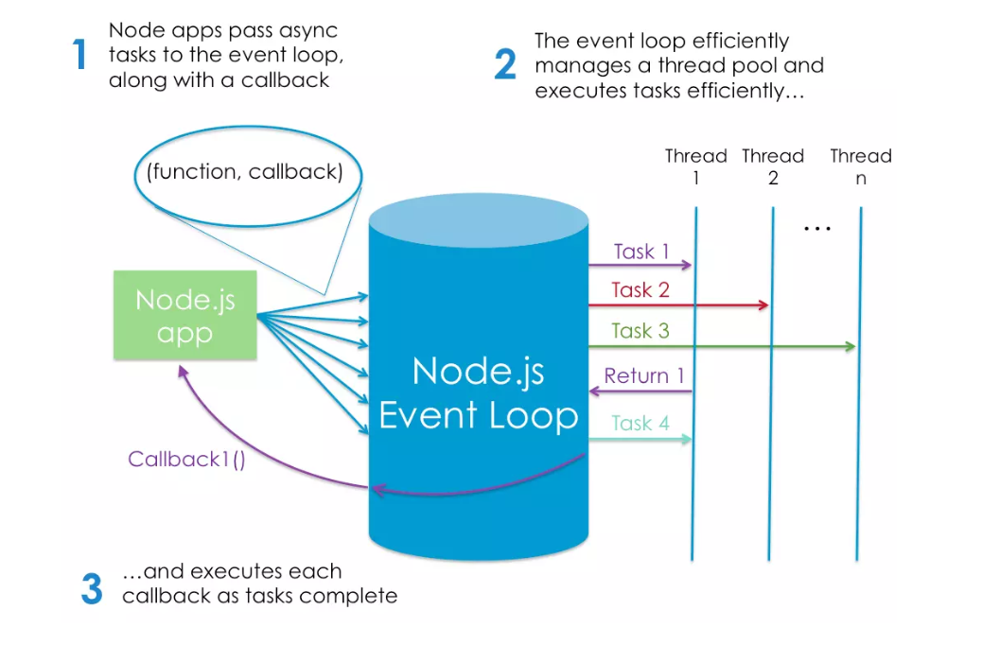

 # Class 06

# NODE.JS:

## An Introduction to Node.js on sitepoint.com - Thinking in React  [source  ](https://www.sitepoint.com/an-introduction-to-node-js/) 
 

### 1- What is node.js?
_back-end technology _
is an event-based, non-blocking, asynchronous I/O runtime that uses Google’s V8 JavaScript engine and libuv library.
### 2- In your own words, what is Chrome’s V8 JavaScript Engine?
open-source JavaScript engine that runs in Google Chrome and other Chromium-based web browsers, including Brave, Opera, and Vivaldi.
responsible for compiling JavaScript directly to native machine code that your computer can execute.

### 3- What does it mean that node is a JavaScript runtime?
This means that Node.js is a program we can use to execute JavaScript on our computers
### 4- What is npm?
a package manager that comes bundled with Node
### 5- What version of node are you running on your machine?
v16.17.0
### 6- What version of npm are you running on your machine?
8.15.0
### 7- what command would you type to install a library/package called ‘jshint’?
npm install -g jshint

### 8- what is node used for?
* build tools —designed to automate the process of developing a modern JavaScript application.
* They can be used for anything from bundling your JavaScript files and dependencies into static assets, to running tests, or automatic code linting and style checking
 
 
 

## 6 Reasons for Pair Programming : [source  ](https://www.codefellows.org/blog/6-reasons-for-pair-programming/)

### 1- What are the 6 reasons for pair programming?
  1. Greater efficiency
  2. Engaged collaboration
  3. Learning from fellow students
  4. Social skills
  5. Job interview readiness
  6. Work environment readiness

### 2- In your experience, which of these reasons have you found most beneficial?

* Learning from fellow students
* Social skills

### 3-How does pair programming work?
pair programming is the practice of two developers sharing a single workstation to interactively tackle a coding task together. At Code Fellows, pair programing is one way we foster a collaborative environment while developing key industry skills.

 
 

## Things I want to know more about
need more practices in node.js