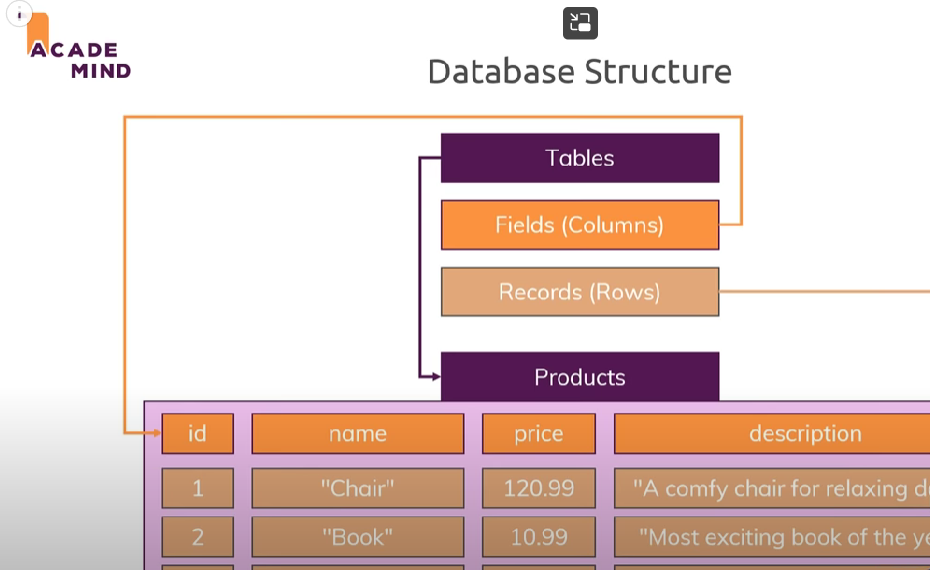
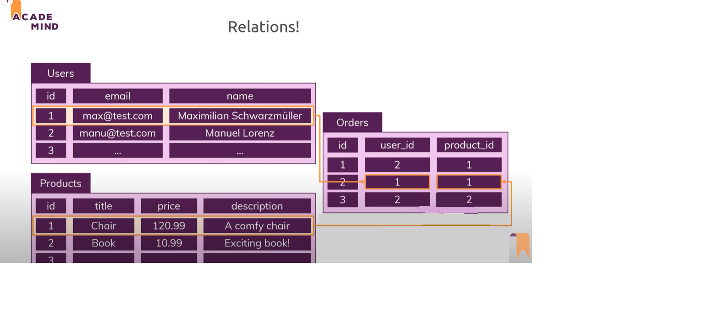

# Class 11

## Mongo and Mongoose:
_

## nosql vs sql [source  ](https://www.thegeekstuff.com/2014/01/sql-vs-nosql-db/?utm_source=tuicool) 

 

### 1-Fill in the chart below with five differences between SQL and NoSQL databases:?
 |                   |      SQL        |     NoSQL                       |
| :---               |    :----:       |     ---                         |  
| called             | Relational Databases (RDBMS)    |non-relational or distributed database|
|                    |  table based      |document based, key-value pairs, graph databases or wide-column stores|   
|      |  have predefined schema    |dynamic schema for unstructured data.|   
|      |   vertically scalable     | horizontally scalable|   
       |  scaled by increasing the horse-power of the hardware   |increasing the databases servers in the pool of resources to reduce the load.|   

### 2- What kind of data is a good fit for an SQL database?

complex query intensive environment ,heavy duty transactional type applications
### 3-Give a real world example.?

### 4- What kind of data is a good fit a NoSQL database.
ierarchical data storage as it follows the key-value pair way of storing data similar to JSON data

### 5- Give a real world example.?

### 6-Which type of database is best for hierarchical data storage?
NoSQL database
### 7-Which type of database is best for scalability?
SQL databases

## sql vs nosql [videos  ](https://www.youtube.com/watch?v=ZS_kXvOeQ5Y) 

 

### 1-What does SQL stand for?
Structured Query Language

### 2-What is a relational database?
that stores and provides access to data points that are related to one another.

### 3-What type of structure does a relational database work with?
table which have fields(columns)and recordes(rows)

### 4- What is a 'schema'?[source  ](https://www.javatpoint.com/database-schema) 
organization of data and provides information about the relationships between the tables in a given database. which shows how the data is stored logically in the entire database. It contains list of attributes and instruction that informs the database engine that how the data is organized and how the elements are related to each other.

### 5- What is a NoSQL database?
as an approach to database designing, which holds a vast diversity of data such as key-value, multimedia, document, columnar, graph formats, external files
### 6- How does it work?
NoSQL databases utilize a hash function behind the scenes to transform each item’s primary key into a number that falls inside a predefined range.

Assume a value between 0 and 100.

This hash value and range are then used to decide where an item should be stored.

### 7- What is inside of a Mongo database?
collection

### 8-Which is more flexible - SQL or MongoDB? and why.
MongoDB is more flexible and ensures high and diverse data availability,
### 9-What is the disadvantage of a NoSQL database?
is that it is very immature. It hardly made it out of the pre-production stages. Many features have not been implanted in it since now.

 
 

## Things I want to know more about
