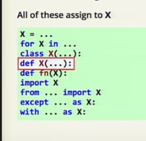

# Class 01

## A friendly intro to Big O Notation

### Big O Notation is used to measure or describe the performance of any algorithm by providing the order of growth of the function.

* O(1) describes an algorithm that will always execute in the same time (or space) regardless of the size of the input data set.
* O(n) describes an algorithm whose performance will grow linearly and in direct proportion to the size of the input data set.
* O(n²) represents an algorithm whose performance is directly proportional to the square of the size of the input data set.
* O(2^n) denotes an algorithm whose growth doubles with each addition to the input data set.

 
 

## Names and Values in Python [source ](https://www.youtube.com/watch?v=_AEJHKGk9ns) 

* Mechanisms are simple but the effects can be surprising 
* data type :
   * number ---> x=23
   * flouts -->  x=23.5
   * string ---> x="walaa"
   * list   ---> x=[12,"hi",[1,2,3]]
   * tuples ---> x=(12,44,"hi")
   * dectionary ---> x={1:1,2:4,3:9,"key":"value"}

* mutable aliasing!
    * A mutable value
    * more than one name
    * the value changes
    * all names see the change!
  
* Lots of things are assignments
  

### For loops
 ### for x in sequence :somyhing(x)

### function (def func(x):statment )

 
 

## Awesome Python Environment [source](https://towardsdatascience.com/how-to-setup-an-awesome-python-environment-for-data-science-or-anything-else-35d358cc95d5)

_this is mainly due to the massive amount of freely available libraries andreadability _ 

###  tools and techniques help you : 
**The Interpreter:**
pyenv is a wonderful tool for managing multiple Python versions.use pyenv to install almost any python interpreter, including pypy, and anaconda.

**Dependency Management**
 poetry : hilp you
 * manage your projects’ dependencies,
 * separate your projects through virtual environments,
 * build both applications as well as libraries without headaches.
 
**Consistent Formatting and Readability**
Black is a tool for python that allows you to focus on what is necessary, the content. It does that by freeing you from manual code formatting through automation

**Type-Correctness**
Mypy is a static type checker for python code, that finds errors before they appear. Adding mypy and type-checking to your project using poetry is as easy as adding black

**Automate the Automation**
Pre-commit is a tool that executes checks before you commit code to your repository

 
 

## Python Module of the Week [source](https://pymotw.com/3/index.html)

**PyMOTW-3 is a series of articles written by Doug Hellmann to demonstrate how to use the modules of the Python 3 standard library. It is based on the original PyMOTW series, which covered Python 2.7. See About Python Module of the Week for details including the version of Python and tools used.**
* Text Manipulation
 * Data Structures
 * Algorithms
 * Cryptography
 * Concurrency and Multithreading
 * Internationalization
 * Networking