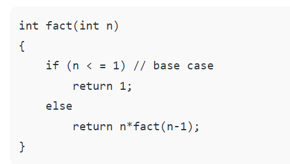

# Class 02

## In Tests We Trust — TDD with Python[source ](https://code.likeagirl.io/in-tests-we-trust-tdd-with-python-af69f47e6932) 
 
 * **Unit tests are some pieces of code to exercise the input, the output and the behaviour of your code. You can write them anytime you want.**
  
 * **The API is pretty straightforward and your work was almost done. But with TDD we need to think about tests first. And to be ok with the possibility of the beginning to be hard sometimes**
  
 * **amazing thing about TDD is how we can grow our software design consciously and well, just building what is needed to make the test pass.** 

### 

 
 

## What does the if __name__ == “__main__”: do?[source ](https://www.geeksforgeeks.org/what-does-the-if-__name__-__main__-do/) 

_**If the python interpreter is running that module (the source file) as the main program, it sets the special __name__ variable to have a value “__main__”. If this file is being imported from another module, __name__ will be set to the module’s name**_

_**A module is a file containing Python definitions and statements. The file name is the module name with the suffix .py appended.**_ 
  

 
 

## Introduction to Recursion – Data Structure and Algorithm Tutorials [source](https://www.geeksforgeeks.org/introduction-to-recursion-data-structure-and-algorithm-tutorials/)

* **Recursion:The process in which a function calls itself directly or indirectly is called recursion and the corresponding function is called a recursive function.**

* **Need of Recursion:to reduce the length of our code and make it easier to read and write**

* **Properties of Recursion:**
    * Performing the same operations multiple times with different inputs.
    * In every step, we try smaller inputs to make the problem smaller.
    * Base condition is needed to stop the recursion otherwise infinite loop will occur.
* **Example**

* **What is the difference between direct and indirect recursion?**
     * direct recursive if it calls the same itself
     * indirect recursive if the first function call secand function ,and the secand function call the first directly or undirectly 

 
 

##  Python Modules and Packages Companion Video[source](https://realpython.com/courses/python-modules-packages/)
### modules:
* **What are advantages of modularizing code in a large application?** 
  
      * simplicity
      * Maintainability
      * reusability
      * Scoping
* **something need to watch in this source**[Real python](https://realpython.com/lessons/writing-module/)
   1. Intro and Course Overview
   2. Writing a Module
   3. The Module Search Path
   4. The import Statement
   5. The dir() Function
   6. Executing a Module as a Script
   7. Reloading a Module
   8. Python Packages
   9. Package Initialization 05:45
   10. Importing "*" From a Package 07:14
   11. Subpackages 06:04
   12. Python Modules and Packages: An Introduction (Summary) 

