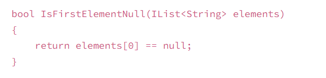

# class 03

## Beginners Guide to Big O [sorcre](https://rob-bell.net/2009/06/a-beginners-guide-to-big-o-notation)

_**Big O notation is used in Computer Science to describe the performance or complexity of an algorithm**_

### O(1)
* **O(1) describes an algorithm that will always execute in the same time (or space) regardless of the size of the input data set.**
  

### O(N)
* **O(N) describes an algorithm whose performance will grow linearly and in direct proportion to the size of the input data set**

.PNG)

### O(N²)
* **O(N²) represents an algorithm whose performance is directly proportional to the square of the size of the input data set**
* 
.PNG)

### O(2^N)
* **O(2^N) denotes an algorithm whose growth doubles with each addition to the input data set.**

.PNG)

### Logarithms
* **Describes an algorithm performance will growth in a logarithmatic shape, where as the data unput increases the operational time becomes more constant where at the begining it increases dramatically with small amount of data then reaches a point where in is almost constant.** 