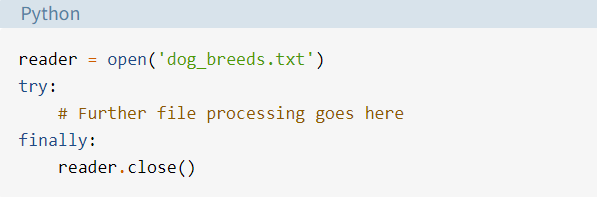
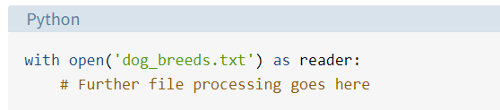
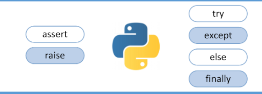

# class 04

## Reading and Writing Files in Python (Guide) .[source](https://realpython.com/read-write-files-python/)

**One of the most common tasks that you can do with Python is reading and writing files. Whether it’s writing to a simple text file.**

* ### Opening and Closing a File in Python.
    1. open the file by use this:
          `file = open('dog_breeds.txt')`
    2. close the file :
         * try-finally block:
         
         

         * the with statement:The with statement automatically takes care of closing the file once it leaves the with block, even in cases of error. 
         
         

         * filename.close()
     
     3. `mode`  argument to represent how you want to open the file, it is the secand argument:
       
        
        | Character             |             Meaning                                                 |   
        | :---                  |            :---                                                     |  
        | 'r'                   |   Open for reading         (default)                                |     
        | 'w'                   |  Open for writing, truncating         (overwriting) the file first  |
        | 'rb' or 'wb'          |  Open in binary mode (read/write using         byte data)           |
       
* ### There are three different categories of file objects:
   1. Text files
     `open('abc.txt')`
     `open('abc.txt', 'r')`
     `open('abc.txt', 'w')`

   2. Buffered binary files
     `open('abc.txt', 'rb')`
     `open('abc.txt', 'wb')`
   3. Raw binary files
      `open('abc.txt', 'rb', buffering=0)`

* ### Reading and Writing Opened Files
 
  | Method                |             What It  Does                                                   |   
  | :---                  |           :---                                                               |  
  | .read(size=-1)        |   This reads from the file based on  the number of size bytes.              |     
  | .readline(size=-1)    |  This reads at most size number of  characters from the line. This continues to the end of the line  and then wraps back around. If no argument is passed or None or  -1 is passed, then the entire line (or rest of the line) is  read. | 
  | .readlines()          |  This reads the remaining lines from  the file object and returns them as a list.|
 

## Python Exceptions: An Introduction .[source](https://realpython.com/python-exceptions/)

**deffrent between syntax error and exception:**
* Syntax errors occur when the parser detects an incorrect statement.ex `print( 0 / 0 ))`
  
* exception error:This type of error occurs whenever syntactically correct Python code results in an error. ex `print( 0 / 0)`

1. **Raising** : allows you to throw an exception at any time.
   
2. **AssertionError** : enables you to verify if a certain condition is met and throw an exception if it isn’t.
   

3. **The try and except Block: Handling Exceptions** :
 * try : all statements are executed until an exception is encountered.
 * except :is used to catch and handle the exception(s) that are encountered in the try clause.
   

5. **The else Clause** : lets you code sections that should run only when no exceptions are encountered in the try clause.
   

6. **Cleaning Up After Using finally** : nables you to execute sections of code that should always run, with or without any previously encountered exceptions.
   
