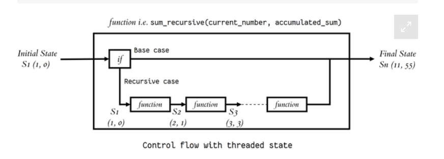

# class 05

## Classes and Objects.[source](https://www.learnpython.org/en/Classes_and_Objects)

**Objects are an encapsulation of variables and functions into a single entity. Objects get their variables and functions from classes. Classes are essentially a template to create your objects.**

#### example: 
  class MyClass:
    variable = "blah"

    def function(self):
        print("This is a message inside the class.")
myobjectx = MyClass()

myobjectx.variable

### init() ` __init__() ` :
**function, is a special function that is called when the class is being initiated. It's used for assigning values in a class.**

## Thinking Recursively in Python.[source](https://realpython.com/python-thinking-recursively/)

* ### typical structure of a recursive algorithm:
  **If the current problem represents a simple case, solve it. If not, divide it into subproblems and apply the same strategy to them.**

  **example**

   

* ### Recursive Functions in Python:
   **unction will continue to call itself and repeat its behavior until some condition is met to return a result.**

   

## Fixtures and Coverage [source](https://www.linuxjournal.com/content/python-testing-pytest-fixtures-and-coverage)

### Fixtures:[source](https://docs.pytest.org/en/latest/explanation/fixtures.html)

*  **you define fixtures using a combination of the `pytest.fixture` decorator**

* **Pytest fixtures are functions that can be used to manage our apps states and dependencies. Most importantly, they can provide data for testing and a wide range of value types when explicitly called by our testing software. You can use the mock data that fixtures create across multiple tests**

   

## Coverage:
**Coverage.py is a tool for measuring code coverage of Python programs. It monitors your program, noting which parts of the code have been executed, then analyzes the source to identify code that could have been executed but was not. Coverage measurement is typically used to gauge the effectiveness of tests.**