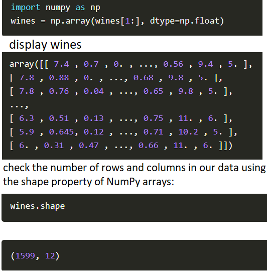
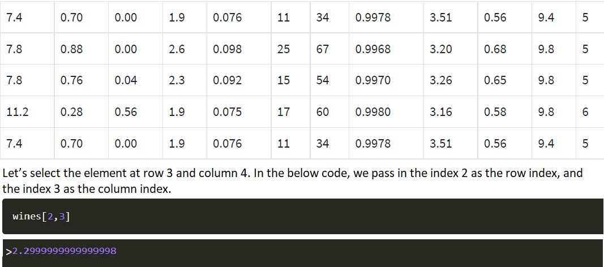
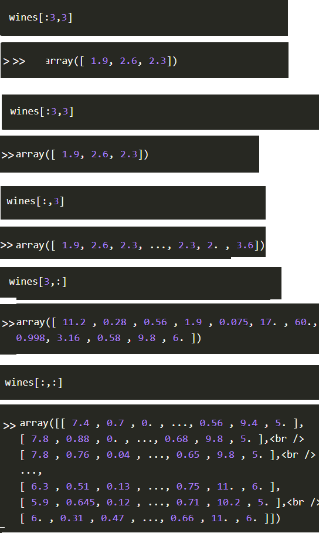

# class 07
## Data Analysis

## Jupyter Lab : [source](https://jupyterlab.readthedocs.io/en/stable/getting_started/overview.html)

* ***is a next-generation web-based user interface for Project Jupyter.***

* ***upyterLab enables you to work with documents and activities such as Jupyter notebooks, text editors, terminals, and custom components in a flexible, integrated, and extensible manner.***

* ***You can arrange multiple documents and activities side by side in the work area using tabs and splitters. Documents and activities integrate with each other***

* ***upyterLab also offers a unified model for viewing and handling data formats. JupyterLab understands many file formats (images, CSV, JSON, Markdown, PDF, Vega, Vega-Lite, etc.) and can also display rich kernel output in these formats***

### install JupyterLab by use pip `pip install jupyterlab`

### Starting JupyterLab : `jupyter lab` JupyterLab will open automatically in your browser.

## NumPy Tutorial: Data Analysis with Python:

* ***NumPy is a commonly used Python data analysis package. By using NumPy, you can speed up your workflow, and interface with other packages in the Python ecosystem, like scikit-learn, that use NumPy under the hood.***

### Numpy 2-Dimensional Arrays :With NumPy, we work with multidimensional arrays ,but for now, we’ll focus on 2-dimensional arrays

 * Creating A NumPy Array 
    
     1. Import Numpy `import numpy as np`
     2. Pass the list of lists wines into the array function, which converts it into a NumPy array `wines = np.array(wines[1:], dtype=np.float)`

    

* Numpy Methods
  
     1.  numpy.zeros(#row,#colume):you can create an array where every element is zero .  
           example:

              empty_array = np.zeros((3,4))

                >> [[0,0,0,0],
                    [0,0,0,0],
                    [0,0,0,0]]

     2. np.random.rand(#row,#colume)
            example:

            np.random.rand(3,4)

            >> array([[ 0.2247223 , 0.92240549, 0.14541893, 0.61731257],
            [ 0.00154957, 0.82342197, 0.74044906, 0.11466845],
            [ 0.6152478 , 0.14433138, 0.13009583, 0.22981301]])

    3. Using NumPy To Read In Files:
   
         example:
             
            wines = np.genfromtxt("winequality-red.csv", delimiter=";", skip_header=1)

    4. Indexing NumPy Arrays
        example :
            

    5. Slicing NumPy Arrays:
        

    6. Assigning Values To NumPy Arrays `wines[1,5] = 10`
    7. Dimensional NumPy Arrays `third_wine = wines[3,:]`
    8. NumPy Data Types  `wines.dtype`
    9. Converting Data Types `wines.astype(int)`
    10. NumPy Array Operations:All of the common operations (/, *, -, +, ^) will work between arrays.
           1. Single Array Math `wines[:,11] + 10`
           2. Multiple Array Math  `wines[:,11] + wines[:,11]`
    11. numpy.ndarray.sum :`wines[:,11].sum() ` >> 9012.0
    12. NumPy Array Comparisons :ike <, >, >=, <=, and ==
           `wines[:,11] > 5` >>array([False, False, False, ..., True, False, True], dtype=bool)

              