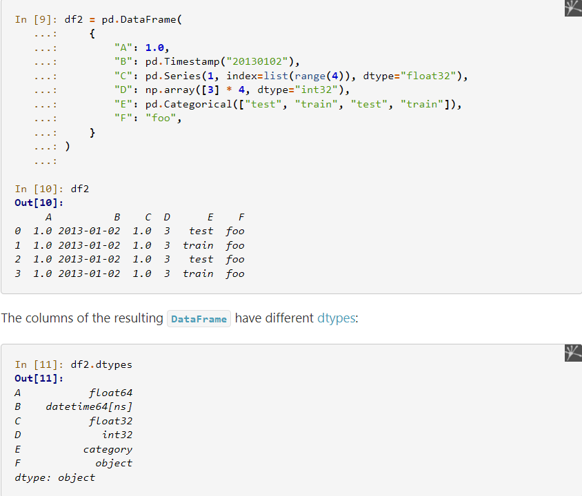
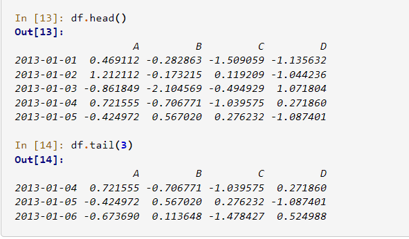

# class 08
## Data Analysis with Pandas

### Pandas in 10 :
[source1](https://pandas.pydata.org/pandas-docs/stable/user_guide/10min.html)

[source2](https://towardsdatascience.com/be-a-more-efficient-data-scientist-today-master-pandas-with-this-guide-ea362d27386)

**pandas is like Excel in Python: it uses tables (namely DataFrame) and operates transformations on the data. But it can do a lot more.**

**Pandas is a game-changer for data science and analytics, particularly if you came to Python because you were searching for something more powerful than Excel and VBA. Pandas uses fast, flexible, and expressive data structures designed to make working with relational or labeled data both easy and intuitive.**

### Object creation

* **import pandas package** : `import pandas as pd`
* **Creating a `Series` by passing a list of values, letting pandas create a default integer index:**
  
      s = pd.Series([1, 3, 5, np.nan, 6, 8])
      s
      >> 0    1.0
         1    3.0
         2    5.0
         3    NaN
         4    6.0
         5    8.0
        dtype: float64

* **Creating a DataFrame by passing a NumPy array, with a datetime index using date_range() and labeled columns:**
    
      ex1:
      dates = pd.date_range("20130101", periods=6)
      dates 
      >> DatetimeIndex(['2013-01-01', '2013-01-02', '2013-01-03', '2013-01-04','2013-01-05', '2013-01-06'],
      dtype='datetime64[ns]', freq='D')

      ex2:
      df = pd.DataFrame(np.random.randn(6, 4), index=dates, columns=list("ABCD"))
      df
      >>                A         B         C        D
         2013-01-01  0.469112 -0.282863 -1.509059 -1.135632
         2013-01-02  1.212112 -0.173215  0.119209 -1.044236
         2013-01-03 -0.861849 -2.104569 -0.494929  1.071804
         2013-01-04  0.721555 -0.706771 -1.039575  0.271860
         2013-01-05 -0.424972  0.567020  0.276232 -1.087401
         2013-01-06 -0.673690  0.113648 -1.478427  0.524988
* **Creating a DataFrame by passing a dictionary of objects that can be converted into a series-like structure:**
        
    
    

 

### Viewing data

1.  ` DataFrame.head() `:to view the toprows of the frame respectively:
2. `DataFrame.tail()`:to view the bottom rows of the frame respectively:
 

 3. `DataFrame.index`
 4. ` DataFrame.columns`
 5. `DataFrame.to_numpy()`
       

        cont with ex2:
        df.to_numpy()
         >>
        array([[ 0.4691, -0.2829, -1.5091, -1.1356],
               [ 1.2121, -0.1732,  0.1192, -1.0442],
               [-0.8618, -2.1046, -0.4949,  1.0718],
               [ 0.7216, -0.7068, -1.0396,  0.2719],
               [-0.425 ,  0.567 ,  0.2762, -1.0874],
               [-0.6737,  0.1136, -1.4784,  0.525 ]])

*note: DataFrame.to_numpy() does not include the index or column labels in the output.*

6. `describe()` shows a quick statistic summary of your data:
   
        ex2:
        df.describe()
        >>
                        A         B         C         D
          count  6.000000  6.000000  6.000000  6.000000
          mean   0.073711 -0.431125 -0.687758 -0.233103
          std    0.843157  0.922818  0.779887  0.973118
          min   -0.861849 -2.104569 -1.509059 -1.135632
          25%   -0.611510 -0.600794 -1.368714 -1.076610
          50%    0.022070 -0.228039 -0.767252 -0.386188
          75%    0.658444  0.041933 -0.034326  0.461706
          max    1.212112  0.567020  0.276232  1.071804

7. Transposing your data:
           
       ex2
       df.T
       >>
       2013-01-01  2013-01-02  2013-01-03  2013-01-04  2013-01-05       2013-01-06
       A    0.469112    1.212112   -0.861849    0.721555   -0.424972    -0.673690
       B   -0.282863   -0.173215   -2.104569   -0.706771    0.567020     0.113648
       C   -1.509059    0.119209   -0.494929   -1.039575    0.276232    -1.478427
       D   -1.135632   -1.044236    1.071804    0.271860   -1.087401     0.524988
       
8. `DataFrame.sort_index()`
9. `DataFrame.sort_values()`

 

### Getting
1. Selecting a single column: 
        
        df["A"]
2. Selecting via [] (__getitem__), which slices the rows:
         
         df[0:3]

### Selection by label
1. ` DataFrame.loc()`
2. `DataFrame.at()`

### Selection by position
1. ` DataFrame.iloc()`
2. ` DataFrame.at()`

### Boolean indexing
      df[df > 0]
### Missing data
1. np.nan
2. DataFrame.dropna()
3. DataFrame.fillna()
4. DataFrame.isna()
   
### Operations
1. Stats
    * df.mean(1)
    * df.shift(2)
  
2. Apply
   * DataFrame.apply()
3. Histogramming
   * s.value_counts()
4. String Methods
   * s.str.lower()

