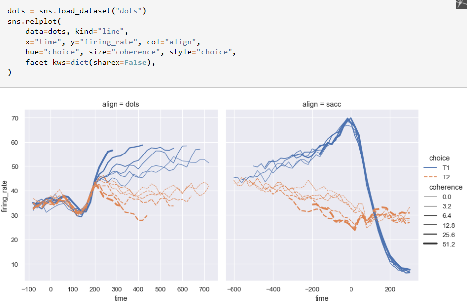

# Read 11 - Data Visualization

## Matplotlib Tutorial:[source](https://github.com/rougier/matplotlib-tutorial)
*matplotlib is probably the single most used Python package for 2D-graphics.*

* **IPython**
*IPython is an enhanced interactive Python shell that has lots of interesting features including named inputs and outputs, access to shell commands, improved debugging and much more.*

* **pyplot**
*pyplot provides a convenient interface to the matplotlib object-oriented plotting library. It is modeled closely after Matlab(TM).*

## seaborn:[source](https://seaborn.pydata.org/tutorial/introduction.html)

**Seaborn is a library for making statistical graphics in Python. It builds on top of matplotlib and integrates closely with pandas data structures.**

**import seaborn** 
`import seaborn as sns`

**A high-level API for statistical graphics**

## Bokeh Tutorial:[source](https://notebooks.gesis.org/binder/jupyter/user/bokeh-bokeh-notebooks-mexcx83p/notebooks/tutorial/00%20-%20Introduction%20and%20Setup.ipynb)

**Bokeh is an interactive visualization library that targets modern web browsers for presentation. It is good for:**

* Interactive visualization in modern browsers
* Standalone HTML documents, or server-backed apps
* Expressive and versatile graphics
* Large, dynamic or streaming data
* Easy usage from python (or Scala, or R, or...)

**imort bokeh**
`from bokeh.io import output_notebook, show`

