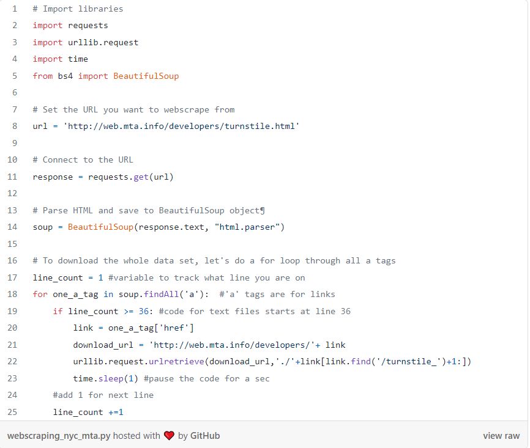

# Read 14 :Web Scraping

## Web Scrape with Python in 4 minutes
 [source1](https://towardsdatascience.com/how-to-web-scrape-with-python-in-4-minutes-bc49186a8460)
 [source2](https://en.wikipedia.org/wiki/Web_scraping)

### Web Scraping
* **is a technique to automatically access and extract large amounts of information from a website, which can save a huge amount of time and effort**

* **The content of a page may be parsed, searched and reformatted, and its data copied into a spreadsheet or loaded into a database.**
  
* **Web pages are built using text-based mark-up languages (HTML and XHTML), and frequently contain a wealth of useful data in text form. However, most web pages are designed for human end-users and not for ease of automated use. As a result, specialized tools and software have been developed to facilitate the scraping of web pages.**
  

### Important notes about web scraping:
1. Read through the website’s Terms and Conditions to understand how you can legally use the data. Most sites prohibit you from using the data for commercial purposes.
2. Make sure you are not downloading data at too rapid a rate because this may break the website. You may potentially be blocked from the site as well.

### Inspecting the Website

### Python Code
1. example
   
   

- **How can websites detect and block web scraping?**
    1. **Unusual traffic/high download rate** especially from a single client/or IP address within a short time span.
    2. **Repetitive tasks performed on the website in the same browsing pattern**: based on an assumption that a human user won’t perform the same repetitive tasks all the time.
    3. **Checking if you are real browser**:  A simple check is to try and execute javascript. Smarter tools can go a lot more and check your Graphic cards and CPUs to make sure you are coming from real browser.
    5. **Detection through honeypots**: these honeypots are usually links which aren’t visible to a normal user but only to a spider. When a scraper/spider tries to access the link, the alarms are tripped.
- **How do you find out if a website has blocked or banned you?**

### source:

 [source1](https://towardsdatascience.com/how-to-web-scrape-with-python-in-4-minutes-bc49186a8460)

 [source2](https://en.wikipedia.org/wiki/Web_scraping)
 
 [source3](https://www.youtube.com/watch?v=Bg9r_yLk7VY)