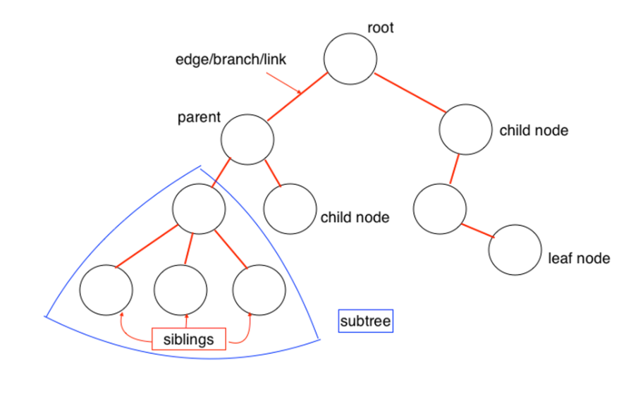

# Read 15 :Tree

## Introduction to Tree [source](https://www.programiz.com/dsa/trees)

   

### Why Tree Data Structure?
* the time complexity increases with the increase in the data size. But, it is not acceptable in today's computational world.
* Different tree data structures allow quicker and easier access to the data as it is a non-linear data structure.

### Tree Terminologies
* **leaf nodes or external nodes**: The last nodes of each path are called , that do not contain a link/pointer to child nodes.

* **internal node**:The node having at least a child node .
* **Edge**:It is the link between any two nodes.
* **Root**: It is the topmost node of a tree.

* **Height of a Node**: The height of a node is the number of edges from the node to the deepest leaf (ie. the longest path from the node to a leaf node).
* **Depth of a Node**:The depth of a node is the number of edges from the root to the node.

* **Height of a Tree** :The height of a Tree is the height of the root node or the depth of the deepest node.

### Tree Applications
1. Binary Search Trees(BSTs) are used to quickly check whether an element is present in a set or not.
2. Heap is a kind of tree that is used for heap sort.
3. A modified version of a tree called Tries is used in modern routers to store routing information.
4. Most popular databases use B-Trees and T-Trees, which are variants of the tree structure we learned above to store their data
5. Compilers use a syntax tree to validate the syntax of every program you write.

## Binary Trees in Python [source](https://www.educative.io/answers/binary-trees-in-python)

### Binary tree:
*A tree whose elements have at most two children is called a binary tree. Each element in a binary tree can have only two children. A node’s left child must have a value less than its parent’s value, and the node’s right child must have a value greater than its parent value.*

## Implementation
-------------
       
       class Node:

    def __init__(self, data):

        self.left = None
        self.right = None
        self.data = data

## Insert method to create nodes
------------
    def insert(self, data):

        if self.data:
            if data < self.data:
                if self.left is None:
                    self.left = Node(data)
                else:
                    self.left.insert(data)
            elif data > self.data:
                if self.right is None:
                    self.right = Node(data)
                else:
                    self.right.insert(data)
        else:
            self.data = data
## findval method to compare the value with nodes
-------------

    def findval(self, lkpval):
        if lkpval < self.data:
            if self.left is None:
                return str(lkpval)+" is not Found"
            return self.left.findval(lkpval)
        elif lkpval > self.data:
            if self.right is None:
                return str(lkpval)+" is not Found"
            return self.right.findval(lkpval)
        else:
            return str(self.data) + " is found"
## Print the tree
-------------

    def PrintTree(self):
        if self.left:
            self.left.PrintTree()
        print(self.data),
        if self.right:
            self.right.PrintTree()

root = Node(27)
root.insert(14)
root.insert(35)
root.insert(31)
root.insert(10)
root.insert(19)
print(root.findval(7))
print(root.findval(14))