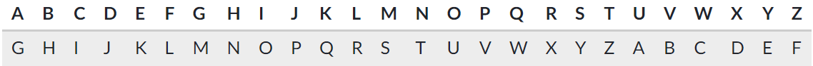
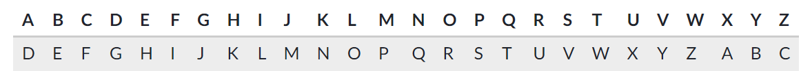
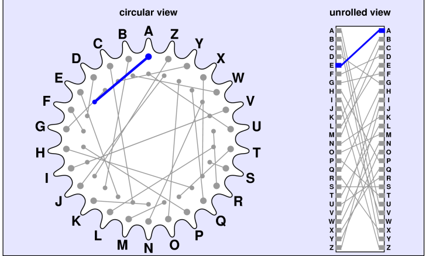

# Read 16: Cryptography

## Encryption, Decryption & Hacking :[source](https://www.khanacademy.org/computing/computers-and-internet/xcae6f4a7ff015e7d:online-data-security/xcae6f4a7ff015e7d:data-encryption-techniques/a/encryption-decryption-and-code-cracking)

* **Encryption**: scrambling the data according to a secret key (in this case, the alphabet shift).
* **Decryption**: recovering the original data from scrambled data by using the secret key.
* **cracking**: uncovering the original data without knowing the secret, by using a variety of clever techniques.

## Ceasar Cipher :[source](https://en.wikipedia.org/wiki/Caesar_cipher)

**is one of the simplest and most widely known encryption techniques. It is a type of substitution cipher in which each letter in the plaintext is replaced by a letter some fixed number of positions down the alphabet.**

1. **Encrypting a message**
      
      The Caesar Cipher is a simple substitution cipher which replaces each original letter with a different letter in the alphabet by shifting the alphabet by a certain amount.
      To make the encrypted message above, I shifted the alphabet by 6 and used this substitution table:

      

2. **Decrypting a message**
   
    According to historical records, Caesar always used a shift of 3. As long as his message recipient knew the shift amount, it was trivial for them to decode the message.

    The comrade uses this substitution table, where the alphabet is shifted by 3:

    

     

     

3. **Cracking the cipher**

    Imagine that a very literate and savvy enemy intercepts one of Caesar's messages.

       RZ VMZ WMDIBDIB VGG AJMXZN OJ EJDI RDOC XGZJKVOMV OJ YZAZVO OCZ ZIZHT LPZZI VO OCZ IDGZ YZGOV

    That enemy does not know that Caesar always uses a shift of 3, so he must attempt to "crack" the cipher without knowing the shift.

    There are three main techniques he could use: frequency analysis, known plaintext, and brute force.

### enigma rotor:

